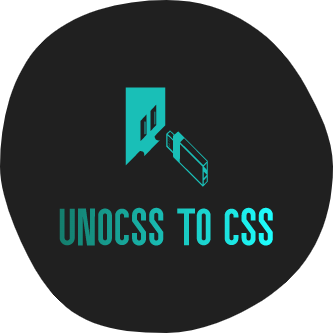

 <a href="./README.md">English</a> | 简体中文

vscode 插件将 [unocss](https://github.com/unocss/unocss) 转换为 css。它由 @unocss/core 提供支持。

## :coffee:

[请我喝一杯咖啡](https://github.com/Simon-He95/sponsor)

## License

[MIT](./license)
